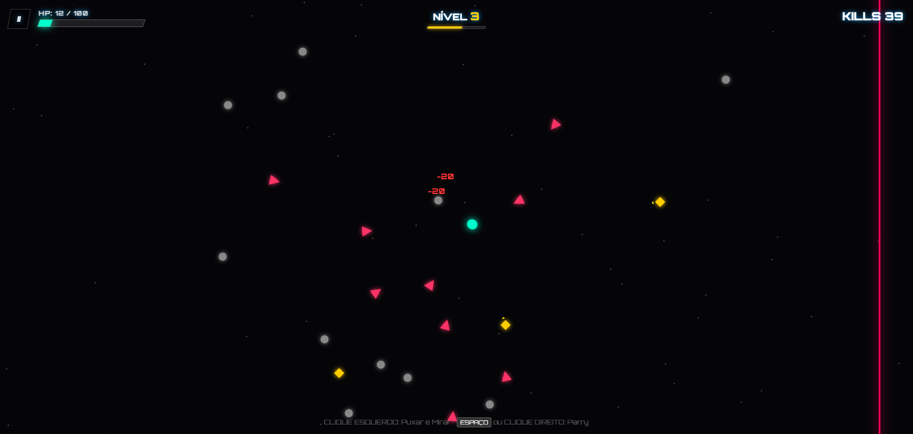

# ⚡ This is Slash Dash - V1.8.1

**Slash Dash** é um roguelike frenético de precisão e velocidade. Domine a arte do corte, utilize o tempo a seu favor e sobreviva a hordas de inimigos em um ambiente neon minimalista.

---

## 🕹️ Como Jogar

O jogo utiliza uma mecânica de movimentação baseada em tensão (estilo estilingue) e defesa reativa.

### Controles
* **Movimento/Ataque:** Segure o **Clique Esquerdo** do mouse e arraste para trás para mirar. Solte para avançar (Dash).
* **Câmera Lenta:** O tempo desacelera temporáriamente enquanto você mira.
* **Parry (Defesa):** Pressione a tecla **Espaço** ou o **Clique Direito** antes de ser atingido.
* **Fadiga:** Se você errar o tempo do Parry, entrará em estado de fadiga e ficará vulnerável por 1 segundo.

---

## 🚀 Mecânicas Principais

* **Sistema de Evolução:** A cada 15 abates, você pode escolher uma melhoria para seu sistema.
* **Variedade de Inimigos:** Enfrente desde *Grunts* básicos até *Snipers* e *Spikers* com padrões de ataque únicos.

---

## 🛠️ Tecnologias Utilizadas

Este projeto foi desenvolvido utilizando tecnologias web puras (Vanilla), focado em performance e leveza:
* **Linguagem:** JavaScript (ES6+).
* **Renderização:** HTML5 Canvas.
* **Estilização:** CSS3 com fontes Google (Orbitron).

---

## 📈 Roadmap / Futuro
- [ ] Implementação de novos chefes.
- [ ] Sistema de conquistas.
- [ ] Diferentes tipos de arenas.
